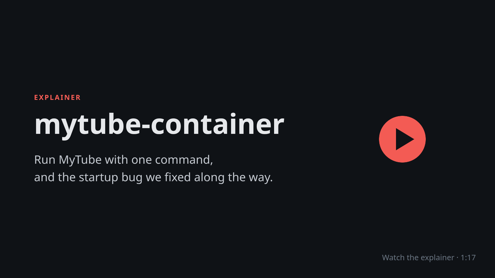

# mytube-container

A Docker Compose setup for running [MyTube](https://github.com/franklioxygen/MyTube), a self-hosted video downloader and player (YouTube, Bilibili, and other yt-dlp-supported sites).

It uses the official single-container image `ghcr.io/franklioxygen/mytube:latest`, which serves both the web UI and the backend API on one port. Images are published for amd64 and arm64.

A short-lived `mytube-init` container runs before MyTube on each start. It sets the data volume's ownership to `PUID`/`PGID` so the app can write to it, then exits. `docker compose ps -a` shows it as exited; that's expected.

## Explainer video

[](docs/explainer.mp4)

A 77-second silent walkthrough of what this repo does, how to run it, and the startup bug the `mytube-init` service fixes. Click the image to open [`docs/explainer.mp4`](docs/explainer.mp4).

## Requirements

- Docker with the Compose plugin (`docker compose version` should work)

## Quick start

```bash
git clone https://github.com/chyld/mytube-container.git
cd mytube-container
docker compose up -d
```

Open **http://localhost:5551**.

- Web UI: `http://localhost:5551`
- API: `http://localhost:5551/api`

## Configuration

Settings are read from environment variables. To change them, copy the example file and edit it:

```bash
cp .env.example .env
```

| Variable | Default | Description |
| --- | --- | --- |
| `MYTUBE_PORT` | `5551` | Host port the UI and API are exposed on. |
| `MYTUBE_UPLOADS_DIR` | `./uploads` | Host folder where downloaded videos and thumbnails are stored. |
| `PUID` / `PGID` | `1000` | User/group ID the app runs as. Set these to the owner of your uploads folder (`id -u`, `id -g`). |
| `MYTUBE_AUTO_FIX_PERMISSIONS` | `1` | Fix ownership of the mounted folders on startup. Set to `0` to disable. |
| `MYTUBE_ADMIN_TRUST_LEVEL` | `container` | Admin trust boundary: `application`, `container`, or `host`. `container` enables in-app features such as the yt-dlp updater. See the [upstream security model](https://github.com/franklioxygen/MyTube/blob/master/documents/en/deployment-security-model.md). |

After editing `.env`, apply the changes with `docker compose up -d`.

## Where data is stored

| Data | Location |
| --- | --- |
| Downloaded videos and thumbnails | `./uploads` (or `MYTUBE_UPLOADS_DIR`) |
| SQLite database, logs, yt-dlp releases | Docker named volume `mytube-data` |

The database lives in a named volume rather than a host folder, as upstream recommends, to avoid SQLite problems with host file ownership and ACLs.

### Backing up

```bash
# Videos
tar czf mytube-uploads.tar.gz uploads/

# Database volume
docker run --rm -v mytube-container_mytube-data:/data -v "$PWD":/backup alpine \
  tar czf /backup/mytube-data.tar.gz -C /data .
```

The volume name is prefixed with the project folder name. Run `docker volume ls` to confirm it.

## Common commands

```bash
docker compose up -d        # start
docker compose down         # stop (data is kept)
docker compose logs -f      # follow logs
docker compose pull && docker compose up -d   # update to the latest image
```

To remove everything, including the database volume:

```bash
docker compose down -v
```

## Troubleshooting

- **`Runtime home directory is not writable ... /app/data/.home`:** the data volume was created before `mytube-init` was added to this repo. Run `git pull`, then `docker compose up -d`.
- **Permission errors writing to `uploads/`:** set `PUID`/`PGID` in `.env` to match the folder's owner, then run `docker compose up -d`.
- **Port already in use:** change `MYTUBE_PORT` in `.env`.
- **`sysctl` error on startup:** some hosts (for example OpenWrt, or rootless Docker) don't allow the IPv6 sysctls. Remove the `sysctls:` block from `docker-compose.yml`.
- **Downloads fail with outdated extractor errors:** update yt-dlp from **Settings → yt-dlp Configuration** in the UI, or pull the latest image.

## Credits

All application code belongs to [franklioxygen/MyTube](https://github.com/franklioxygen/MyTube). This repo only contains deployment configuration.
